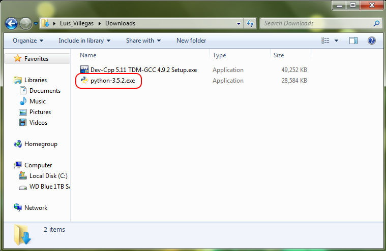
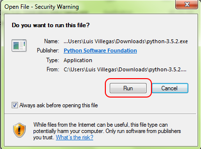
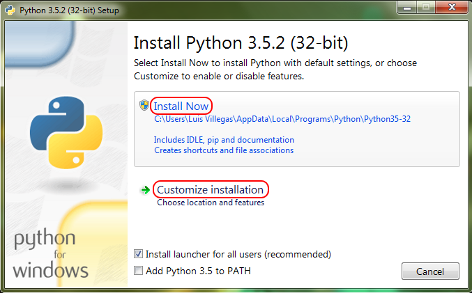
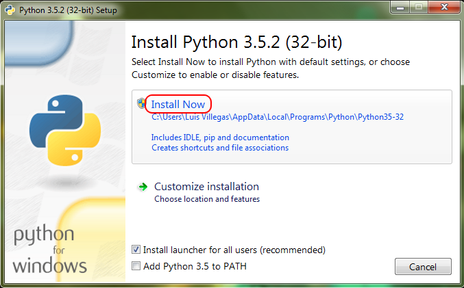
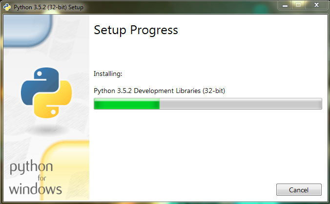
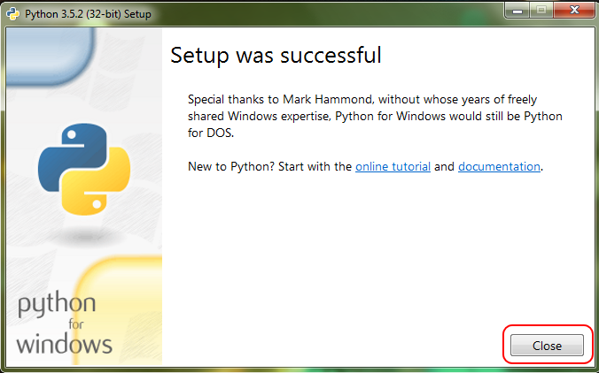
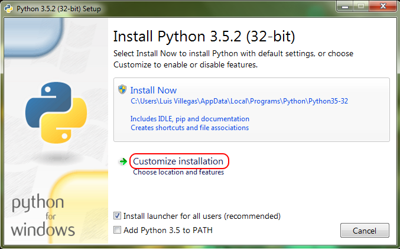
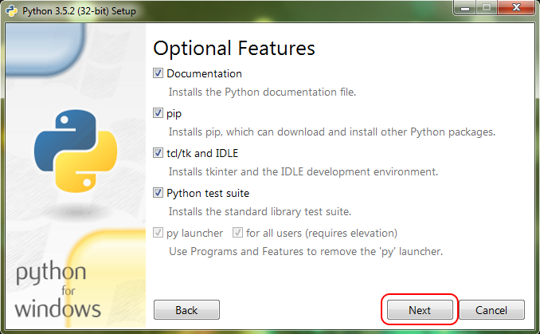
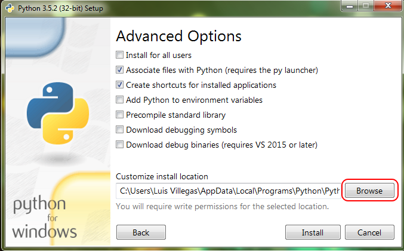
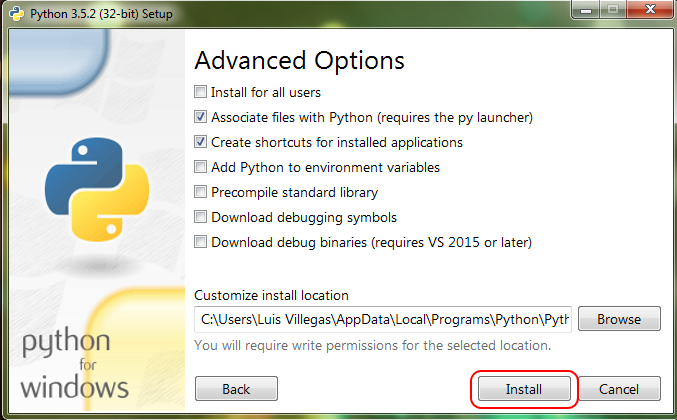

:Camp: Intro to Python
:Instructor: Luis Villegas

Introduction
============

This page is intended to provide assistance in the installatino and set up of Python 3.5.2 that will be used during the camp.

Download (Windows)
=================

Python 3.5.2 can be downloaded from the following link:

- https://www.python.org/ftp/python/3.5.2/python-3.5.2.exe

Download shoudl commence emediately after clicking the link.

If you would like to visit the web site before download, use the follwing link:

- https://www.python.org/downloads/

Installation
============

The following demonstrates the installatino for Windows.

Windows Machine
+++++++++++++++

To begin installation of **Python 3.5.2** , locate where the download was saved and run the executable called "". By default the file should be located in the *Downloads* directory/folder.

You will be asked if you would like to run the program, click **Run**.

Next you will be given two options of instalatino, an express method or a custom method. The differeance in the two optinos is that the custom allows you to choose the locatino of where **Python 3.5.2** is installed.

If you would like to run the express installatino, click **Install Now**. If yo u choose to do the custom installation, click **Customized Installation** and move down this page to *Customized Installatino* section.

Install Now
-----------

After clicking **Install Now**, the installation will begin soon after.

Once the installatino is complete, you will see the following screen. Click **Close**.

The Installatino is now complete and you are ready to begin your journey into prgrammin using Python 3.5.2.

Customized Installation
--------------------------

After clicking **Customized Installation**, you will be prompted to select whitch python options you would like to includ in the installation. By default, all optinos are selected. It is recommended to include the defaults. Then click **Next**.

Next you will be prompted to select the advanced optinos as well as choose the location where **Python 3.5.2** will be installed. It is recomended to leave the default advanced optinos selected (Options selected in the image below). If you would like to pick a different location to install **Python 3.5.2**, click **Browse**.

Once you have chosen the locatino for the installation, click **Install** to begin the installatino.

The installation will begin soon after.

Once the installatino is complete, you will see the following screen. Click **Close**.

The Installatino is now complete and you are ready to begin your journey into prgrammin using Python 3.5.2.

